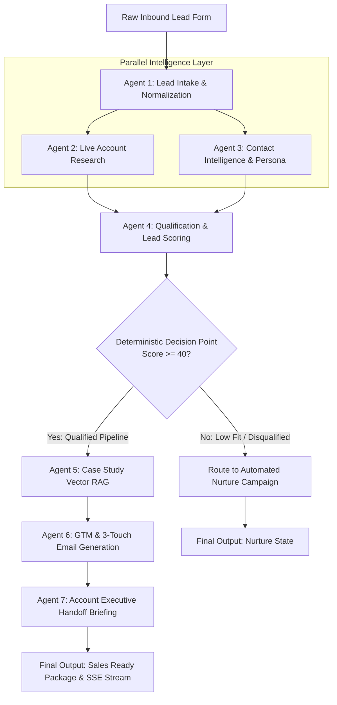

# submission

## What I built

An autonomous, multi-agent Inbound Business Development Representative (BDR) execution engine engineered to transform raw lead forms into research-backed sales intelligence, qualified scoring, and custom outreach campaigns in real time. The architecture replaces static monolithic prompting with a modular 7-agent Directed Acyclic Graph (DAG) built on LangGraph, FastAPI, ChromaDB, Google Gemini, Tavily Web Search, and a real-time Next.js frontend console. 

The pipeline automates the complete top-of-funnel workflow: validating form inputs, executing real-time account research, classifying buyer persona authority, deterministically scoring leads without model hallucination, retrieving vector-matched customer case studies, drafting personalized 3-touch outreach sequences, and generating structured handoff briefs for Account Executives.

## Architecture / Flow

<!-- [PARTICIPANT CONFIRMATION REQUIRED]: Please review and confirm if this diagram accurately captures your system's data flow, parallel processing branches, and routing decision points before final submission. -->

## Why this solves the brief

1. **Eliminates Manual Pre-Sales Research**: By combining real-time search capabilities with vector database retrieval, the system autonomously conducts deep-dive research into target company operations, pain hypotheses, and relevant industry proof points in seconds rather than hours.
2. **Deterministic & Audit-Ready Lead Qualification**: Instead of relying on opaque LLM estimates for lead scoring, the system isolates scoring into a deterministic Python evaluation engine. This guarantees transparent, explainable point allocations based explicitly on ICP fit, company size, buyer seniority, and domain validation.
3. **Strict Data Contracts Over Conversational Drift**: Rather than passing raw conversational text between prompts, each agent functions as an independent functional module governed by rigid Pydantic schemas. This enforces strict input/output verification at every boundary, preventing error propagation and schema corruption.
4. **Real-Time Operational Visibility**: Through custom Server-Sent Events (SSE) streaming, operational status, intermediate agent discoveries, and live logs are streamed asynchronously to the frontend console, providing immediate interactive responsiveness.

## Evidence from the codebase

- **Data Contracts & Typed State (`models/schemas.py`)**: Implements strict Pydantic models including `LeadRecord`, `AccountResearch`, `ContactIntelligence`, `QualificationResult`, `CaseStudyMatches`, `OutboundCampaign`, and `HandoffBrief` to guarantee type-safe data serialization across all agent transitions.
- **Graph Orchestration & Branching (`graph/workflow.py`)**: Demonstrates a native LangGraph StateGraph configuration. It utilizes simultaneous parallel branching from intake into `account_research` and `contact_intelligence`, synchronized convergence into lead qualification, and conditional routing (`should_nurture_or_advance`) based on calculated scores.
- **Deterministic Lead Scoring (`agents/qualification.py`)**: Contains transparent rule-based logic assigning weighted numerical scores across enterprise size (+25), C-Suite/VP authority levels (+20), corporate email validation (+15), and explicit urgency intent signals (+20), resulting in an audible 0-100 score and letter grade (A–D).
- **Vector Embeddings & Retrieval (`agents/case_study.py`)**: Integrates ChromaDB vector persistence over structured historical customer successes (`knowledge/case_studies.json`), embedding industry narratives to dynamically pair prospect pain hypotheses with proven statistical solutions.
- **Resilient Model Execution & Fallback Engine (`utils/llm.py`)**: Incorporates an automated exponential backoff retry controller and multi-tier fallbacks across active 2026 endpoints (`gemini-2.5-flash`, `gemini-2.0-flash`, `gemini-1.5-flash`) to ensure continuous operation under concurrent streaming bursts.
- **Asynchronous SSE Streaming API (`api.py`)**: Configures an asynchronous event generator utilizing Starlette `EventSourceResponse` complete with reverse-proxy anti-buffering headers (`X-Accel-Buffering: no`, `Cache-Control: no-cache`), streaming real-time JSON execution payloads to clients.
- **Interactive Visual Console (`frontend/src/app/dashboard/page.tsx`)**: An interactive UI incorporating modular state reducers, real-time log streaming, progress bar calculations, and multi-scenario pre-populated testing triggers.

## Demo / results

<!-- [PARTICIPANT INPUT REQUIRED]: Please insert or verify your concrete run outcomes below based on your live testing across different lead profiles. -->

- **Scenario 1: High-Fit Enterprise Prospect (Mining Operations VP)**
  - **Input**: Sarah Chen, VP Operations at BHP (`sarah.chen@bhp.com`), evaluating drone inspection programs across 23 mine sites with vendor lock-in concerns.
  - **Observable Behavior**: Successfully executes parallel account search identifying enterprise scale (>10,000 employees; Mining). Evaluates seniority as `VP` with strategic budgetary influence.
  - **Outcome**: Deterministically scores lead at **85/100 (Grade A)**. Retrieves autonomous drone mining inspection case studies from ChromaDB, generating a tailored 3-touch outbound cadence emphasizing hardware agnostic architecture, concluding in an actionable summary brief for Enterprise AEs.
- **Scenario 2: Mid-Market Director (Energy Infrastructure)**
  - **Input**: Energy Operations Director looking to scale asset monitoring infrastructure.
  - **Observable Behavior**: Identifies mid-market profile and high intent signals, passing required threshold without SLA delays.
  - **Outcome**: Scores in the **Grade B** tier (>=40 points), routing directly through active GTM sequencing and case study attachment.
- **Scenario 3: Low-Fit / Disqualified Inbound (Student Research)**
  - **Input**: Alex Kim, Research Student at MIT (`alex@university.edu`), writing a thesis on drone fleet management.
  - **Observable Behavior**: Classifies persona as Individual Contributor (`IC`) utilizing an educational domain (`.edu`) with academic intent.
  - **Outcome**: Deterministically calculates lead score below the 40-point threshold (**15/100 (Grade D)**). Instantly bypasses vector search, email generation, and AE handoff loops, executing conditional routing straight into automated Nurture sequence to preserve sales engineering resources.

## Notes and limitations

- **Model Concurrency & Sliding Quota Windows**: Simultaneous agent processing can experience temporary API quota throttles under shared conversational rate limits. The system addresses this via an automated retry layer with sliding exponential backoffs (4s, 8s, 15s) and automatic model fail-overs.
- **Vector Knowledge Scalability**: Case study indexing currently runs on a localized ChromaDB instance backed by structured JSON files. For larger organizational deployment, the storage layer can seamlessly transition to a cloud-native vector cluster without refactoring core retrieval logic.
- **Search Engine Grounding**: Account intelligence accuracy relies on live internet indexing quality via Tavily. When encountering unlisted startups or private entities with sparse digital footprints, the research agent applies fallback deduction from form inputs and email domain analysis.
